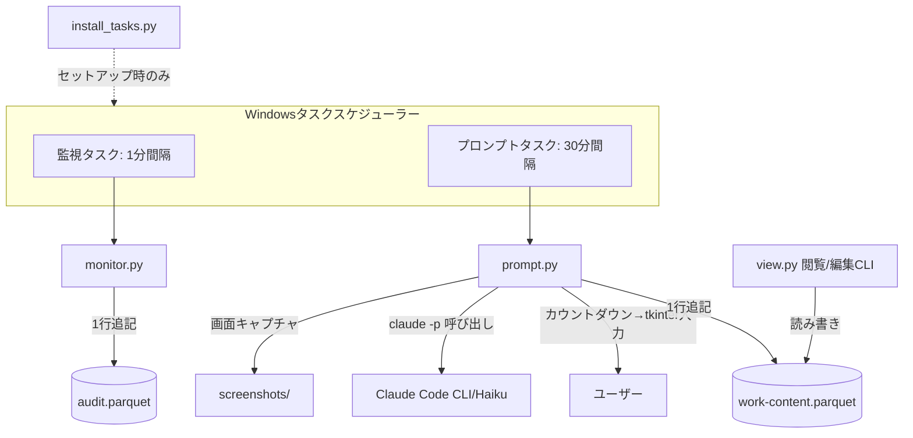

# 作業監視・記録アプリ ゼロベース再構築 設計書

## 背景・目的

旧アプリ（`main`ブランチ、Tauri/Rust常駐アプリ）は、アプリ内蔵のスケジューラーが常駐して30分ごとの確認プロンプトと1分ごとの操作監視を行っていた。常駐プロセスの死活監視・自動復旧・ウォッチドッグなど、本質的でない複雑さが増大したため、`rebuild`ブランチで一旦全コードを削除し、ゼロベースで設計し直す。

新設計の核心は「常駐をやめ、スケジューリングをWindowsタスクスケジューラーに完全委任する」こと。アプリ本体は状態を持たない短命CLIプロセスの集合とする。

## 全体構成

Windowsタスクスケジューラーが起動する2つの短命Pythonプロセス（監視・プロンプト）と、記録済みデータの閲覧/編集用CLIツール、およびタスク登録用セットアップスクリプトの4本立て。常駐プロセスは存在しない。



両タスクとも次の条件でトリガーを設定する。

- 平日（月〜金）7:00〜22:00の間のみ起動（深夜・土日は起動しない）
- 「既に実行中なら新しいインスタンスを開始しない」設定（`schtasks`の`/RU`とタスク定義XMLの`MultipleInstancesPolicy=IgnoreNew`相当）を用いて多重起動を防止する。アプリ側でのロックファイル管理は行わない

## データ配置

```
data/YYYY/MM/DD/audit.parquet          # 1分ごとの監視ログ
data/YYYY/MM/DD/work-content.parquet   # 30分ごとの作業内容
data/YYYY/MM/DD/screenshots/HHMM.png   # プロンプト時に撮影したスクリーンショット
logs/                                    # 実行時エラーログ（日付ローテーション等は最小限）
```

日付ディレクトリは各プロセスが起動時に存在しなければ作成する。

## コンポーネント

### 1. `monitor.py`（1分間隔・監視、タスクスケジューラー起動）

**責務**: フォアグラウンドウィンドウ情報とアイドル秒数を1回取得し、当日の`audit.parquet`に1行追記して終了する。

**処理フロー**:
1. `GetForegroundWindow`相当のWin32 API（`pywin32`）でフォアグラウンドウィンドウのハンドルを取得
2. ウィンドウタイトル、所属プロセスのイメージ名を取得
3. `GetLastInputInfo`相当のAPIで直前入力からの経過秒数（アイドル秒数）を計算
4. `data/YYYY/MM/DD/audit.parquet`が存在すれば読み込み、存在しなければ空のDataFrameを新規作成
5. 取得した1行を追加し、Parquetとして上書き保存
6. 例外発生時は`logs/monitor_error.log`に追記し、非0終了（タスクスケジューラーの実行履歴に失敗として残す）

**スキーマ（audit.parquet）**:

| 列名 | 型 | 説明 |
|---|---|---|
| `timestamp` | datetime | 取得時刻 |
| `foreground_window_title` | string | 最前面ウィンドウのタイトル |
| `foreground_process_name` | string | 最前面プロセスの実行ファイル名 |
| `idle_seconds` | int | 直前の入力からの経過秒数 |

取得失敗（フォアグラウンドウィンドウなし等）の場合、タイトル・プロセス名は空文字とし、行自体は記録する（欠損なく1分粒度を保つため）。

### 2. `prompt.py`（30分間隔・入力促し、タスクスケジューラー起動）

**責務**: 予告カウントダウン→スクリーンショット撮影→Haiku推定→ユーザー確認ダイアログ→確定値を`work-content.parquet`に記録、の一連を1プロセスで完結させる。

**処理フロー**:
1. **予告カウントダウン**: tkinterの小窓（枠なし・最前面・画面右下）を表示し、「まもなく作業内容の確認が表示されます」と残り秒数（既定30秒）をカウントダウン表示。クリックで即座に次段階へ進めるようにする
2. **スクリーンショット撮影**: カウントダウン終了後、全画面をキャプチャし`data/YYYY/MM/DD/screenshots/HHMM.png`に保存（`HHMM`は当該30分枠の開始時刻）
3. **直近ログの集計**: 当日の`audit.parquet`から直近30分ぶんの行を抽出し、頻出のウィンドウタイトル・プロセス名を要約したテキストを組み立てる
4. **Haiku推定**: `claude -p "<プロンプト文（要約テキストとスクショパスを含む）>" --model haiku`をサブプロセス実行し、標準出力を`predicted_text`とする。失敗時は`predicted_text`を空文字にしてフローは継続する
5. **確認ダイアログ**: tkinterウィンドウを表示。テキスト入力欄に`predicted_text`を初期値として表示し、ユーザーは編集してEnter/確定ボタンで確定できる
6. **タイムアウト自動確定**: ダイアログ表示から5分間ユーザー操作がなければ、`predicted_text`のまま自動確定してウィンドウを閉じる
7. `data/YYYY/MM/DD/work-content.parquet`に1行追記して終了

**スキーマ（work-content.parquet）**:

| 列名 | 型 | 説明 |
|---|---|---|
| `slot_start` | datetime | 枠の開始時刻（例: 09:30） |
| `slot_end` | datetime | 枠の終了時刻（例: 10:00） |
| `predicted_text` | string | Haikuによる推定作業内容 |
| `confirmed_text` | string | ユーザーが確定した作業内容（自動確定時は`predicted_text`と同値） |
| `status` | string | `confirmed`（ユーザーが手動確定）または`auto_confirmed`（5分無応答で自動確定） |
| `screenshot_path` | string | 撮影したスクリーンショットの相対パス |

**フルスクリーンアプリへの配慮は行わない**（動画視聴・ゲーム中でも構わずダイアログを表示する）。

### 3. `view.py`（閲覧・編集CLI）

**責務**: 指定日の`work-content.parquet`をターミナル上で一覧表示し、行を選択して`confirmed_text`を編集・保存できるようにする。

**使い方（想定）**:
```
python view.py --date 2026-08-26
```
- 各行（枠）を`slot_start〜slot_end | status | confirmed_text`の形で一覧表示
- 番号または矢印キーで行を選び、テキスト編集（素直な行編集。vi風キーバインドにはこだわらない）
- 編集後、`work-content.parquet`の該当行を上書き保存
- `audit.parquet`は本ツールの対象外（表示・編集どちらも行わない）

実装は標準ライブラリの`input()`ベースの対話ループ（番号入力→編集→保存）とし、curses等の高度なTUIは必須要件としない。

### 4. `install_tasks.py`（セットアップスクリプト）

**責務**: `schtasks`コマンドを呼び出し、監視タスクとプロンプトタスクをWindowsタスクスケジューラーに登録する。

- 監視タスク: `monitor.py`を1分間隔、平日7:00〜22:00の間のみ実行、多重起動時は新規開始しない
- プロンプトタスク: `prompt.py`を30分間隔、平日7:00〜22:00の間のみ実行、多重起動時は新規開始しない
- 実行コマンドはプロジェクトの仮想環境Pythonインタプリタのフルパスを使用する
- 既存タスクが存在する場合は削除してから再作成する（再実行可能にする）
- タスク定義はXML経由で`schtasks /create /xml`を使い、`MultipleInstancesPolicy`と時間帯制限トリガーを正確に指定する

## エラーハンドリング方針

- 各プロセスの想定外例外は`logs/<component>_error.log`にスタックトレースを追記し、非0終了する（タスクスケジューラーの実行履歴で失敗を追跡できるようにする）
- Parquet読み書き失敗時はリトライせず、当該実行を諦めて次回トリガーでの復帰に委ねる（1分/30分間隔で頻繁に再試行されるため）
- `claude -p`呼び出し失敗（CLI未インストール、タイムアウト等）は致命的エラーとせず、`predicted_text`を空文字としてダイアログ表示を継続する

## 依存ライブラリ（想定）

- `pandas` + `pyarrow`（Parquet読み書き）
- `mss`または`Pillow`（全画面スクリーンショット）
- `pywin32`（フォアグラウンドウィンドウ・アイドル時間取得）
- 標準ライブラリ: `tkinter`（GUI）、`subprocess`（`claude -p`呼び出し、`schtasks`呼び出し）

## スコープ外（今回やらないこと）

- アプリ内蔵のスケジューリング・タイマー処理
- 常駐プロセス・システムトレイ常駐
- フルスクリーンアプリ検出による表示抑制
- 監視ログ（`audit.parquet`）の閲覧・編集機能
- 多重起動防止のためのアプリ側ロックファイル（タスクスケジューラーの設定に一任）
- 深夜・土日の自動確定処理（タスク自体が時間外に起動しないため不要）
